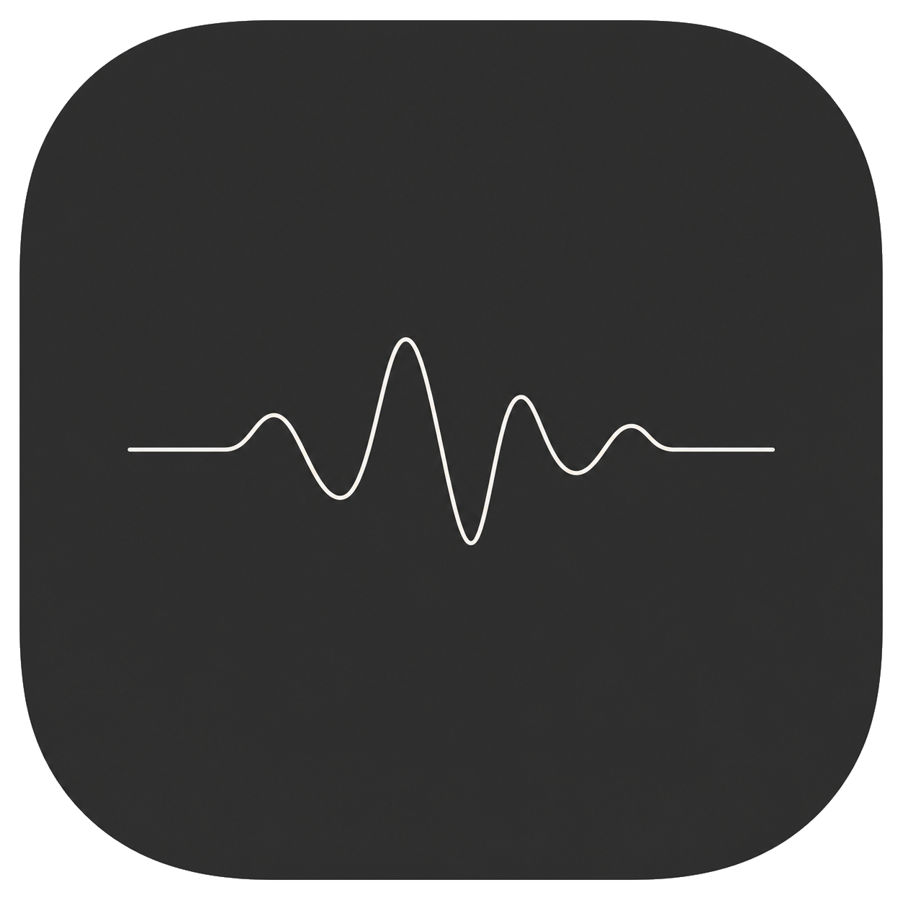

<div align="center">



# Orbly

**Diktier-App für macOS. Fn halten, sprechen, loslassen. Der Text landet an der Cursor-Position.**

Transkribiert wird auf deinem Mac, nicht in der Cloud. Kein Konto, keine Telemetrie.


</div>

## Download

**[Orbly für macOS herunterladen](https://orbly-website.vercel.app)**

Signiert und von Apple notarisiert, öffnet also ohne Sicherheitswarnung. Universal
Binary für Apple Silicon und Intel, macOS 14 oder neuer. Die App aktualisiert sich
selbst.

## Bedienung

| Aktion | Wirkung |
|---|---|
| **Fn halten** | Aufnehmen solange gedrückt, beim Loslassen wird transkribiert |
| **Fn kurz tippen** | Aufnahme läuft weiter, erneutes Tippen beendet sie |
| **Esc** | Abbrechen, auch während der Verarbeitung |

## Features

- **Läuft offline.** Whisper-Engine liegt in der App, kein Homebrew, keine Installation.
- **Fünf Sprachen in der Oberfläche** (en, de, es, fr, ru), Spracherkennung automatisch.
- **Eigener Server möglich.** Whisper auf einem anderen Rechner laufen lassen und den
  RAM des Macs freihalten. OpenAI-kompatible Endpunkte funktionieren auch.
- **Overlay mit Live-Pegel**, vier Stile, Position frei wählbar.
- **Statistik und Verlauf.** Die Statistik speichert nur Zahlen, nie den Text. Der
  Verlauf ist abschaltbar, löschbar und altert nach drei Tagen von selbst aus.
- **Menüleiste statt Fenster.** Kein Programm, das im Weg steht.

## Datenschutz

Deine Aufnahmen und Texte verlassen den Mac nicht. Ins Netz geht Orbly an genau drei
Stellen, und alle drei kannst du im Code nachlesen:

| Wohin | Wann | Was |
|---|---|---|
| `127.0.0.1` | bei jedem Diktat | die Aufnahme, an die lokale Engine |
| `huggingface.co` | einmalig | Download des Sprachmodells |
| Update-Feed | beim Start | Versionsprüfung, abschaltbar |

Kein Konto, keine Telemetrie, keine Analyse, kein Gerätekennzeichen. Ein Test in
diesem Repo schlägt fehl, wenn jemand ein Textfeld in die Statistik einbaut, damit
bleibt das Versprechen überprüfbar statt behauptet.

## Selbst bauen

```bash
brew install cmake                    # einmalig, für die Whisper-Engine
bash scripts/make-signing-cert.sh     # einmalig, stabiles Signier-Zertifikat
bash scripts/build-app.sh             # baut Engine + App, installiert nach /Applications
```

Ohne eigenes Zertifikat wird ad-hoc signiert, und dann verwirft macOS die
Bedienungshilfen-Berechtigung bei **jedem** Neubau. Deshalb der zweite Schritt.

Beim ersten Start Mikrofon und Bedienungshilfen erlauben, und in den
Systemeinstellungen unter Tastatur „Fn-Taste drücken für" auf **„Keine Aktion"**
stellen, sonst öffnet macOS seine eigene Diktierfunktion.

```bash
swift test    # 48 Tests
```

## Technik

- Swift, SwiftUI und AppKit, gebaut mit SwiftPM, kein Xcode-Projekt nötig
- [whisper.cpp](https://github.com/ggml-org/whisper.cpp) als Engine, statisch gebaut
  und mit im App-Bundle
- Fn-Erkennung über `NSEvent`-Monitore, Aufnahme über `AVAudioEngine` (16 kHz mono)
- Einfügen über die Zwischenablage und simuliertes ⌘V, danach wird die Zwischenablage
  wiederhergestellt
- Metal für das Orb-Overlay, Swift Charts für die Statistik,
  [Sparkle](https://sparkle-project.org) für Updates

## Beitragen

Fehlerberichte und Pull Requests sind willkommen. Vor einem größeren Umbau kurz ein
Issue aufmachen, damit die Arbeit nicht ins Leere läuft. Details in
[CONTRIBUTING.md](.github/CONTRIBUTING.md).

Zwei Dinge prüfen die Tests automatisch: Neue nutzersichtbare Texte müssen in
`Sources/Orbly/L10n.swift` in **allen fünf** Sprachen stehen, und UI-Texte enthalten
keine Gedankenstriche.

## Lizenz

[GNU AGPL v3](LICENSE). Du darfst den Code benutzen, ändern und weitergeben. Wenn du
eine geänderte Version verbreitest oder als Dienst anbietest, muss dein Quellcode
ebenfalls unter der AGPL offen liegen.

Falls später kostenpflichtige Zusatzfunktionen dazukommen, liegen die außerhalb dieses
Repos. Alles hier bleibt unter der AGPL.

## Dank

[whisper.cpp](https://github.com/ggml-org/whisper.cpp) von Georgi Gerganov und den
ggml-Beitragenden, [Whisper](https://github.com/openai/whisper) von OpenAI und
[Sparkle](https://sparkle-project.org) für die Update-Infrastruktur.
