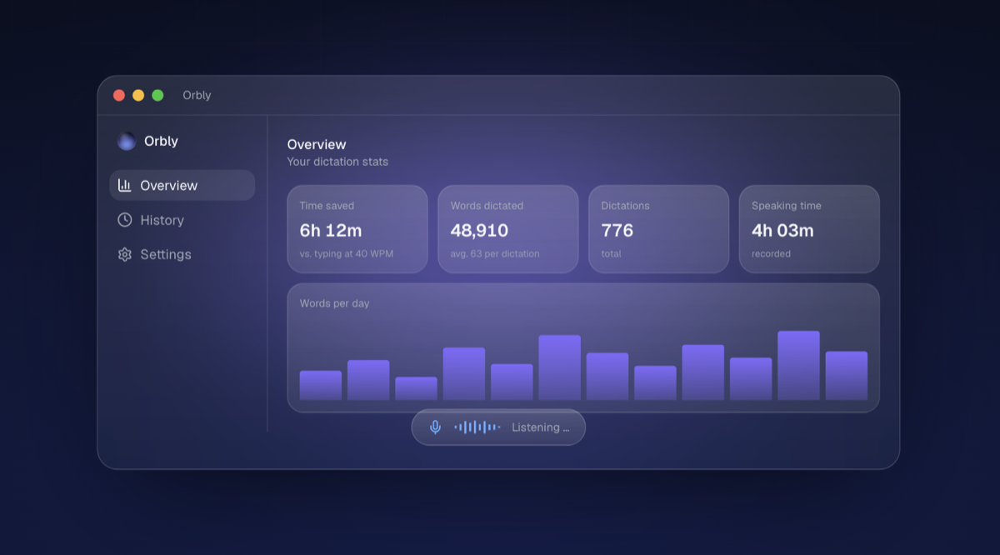

<div align="center">


# Orbly

**Dictation for macOS. Hold Fn, speak, let go. The text lands at your cursor.**

Transcription runs on your Mac, not in the cloud. No account, no telemetry.


[Deutsche Version](README.de.md)

<br />


</div>

## Download

**[Download Orbly for macOS](https://orbly-website.vercel.app)**

Signed and notarised by Apple, so it opens without a security warning. Universal
binary for Apple Silicon and Intel, macOS 14 or newer. The app updates itself.

## How to use it

| Action | Result |
|---|---|
| **Hold Fn** | Records while held. Transcribes when you let go. |
| **Tap Fn** | Recording keeps running. Tap again to stop. |
| **Esc** | Cancel, even while it is processing. |

The text is inserted at the cursor position in whatever app you are in. That works
in Mail, Slack, your editor, a browser field, the terminal, anywhere.

## Features

- **Works offline.** The Whisper engine ships inside the app. No Homebrew, no install step.
- **Five interface languages** (en, de, es, fr, ru). Spoken language is detected automatically.
- **Bring your own server.** Point Orbly at a Whisper server on another machine and keep
  your Mac's RAM free. OpenAI-compatible endpoints work too.
- **Overlay with a live level meter**, four styles, position of your choice.
- **Stats and history.** Stats store numbers only, never your text. History can be
  turned off, cleared, and expires by itself after three days.
- **Menu bar, not a window.** Nothing sitting in your way.



## Privacy

Your recordings and your text do not leave the Mac. Orbly talks to the network in
exactly three places, and you can read all three in the source:

| Where | When | What |
|---|---|---|
| `127.0.0.1` | every dictation | the recording, to the local engine |
| `huggingface.co` | once | download of the speech model |
| update feed | at launch | version check, can be turned off |

No account, no telemetry, no analytics, no device identifier. A test in this repo
fails if anyone adds a text field to the stats, so the promise stays verifiable
instead of merely claimed.

## Build it yourself

```bash
brew install cmake                    # once, for the Whisper engine
bash scripts/make-signing-cert.sh     # once, for a stable signing certificate
bash scripts/build-app.sh             # builds engine + app, installs to /Applications
```

Without your own certificate the app is signed ad hoc, and macOS then drops the
Accessibility permission on **every** rebuild. That is what step two is for.

On first launch, allow microphone and Accessibility access, and in System Settings
under Keyboard set "Press Fn key to" to **"Do Nothing"**, otherwise macOS opens its
own dictation instead.

```bash
swift test    # 48 tests
```

## How it works

- Swift, SwiftUI and AppKit, built with SwiftPM. No Xcode project needed.
- [whisper.cpp](https://github.com/ggml-org/whisper.cpp) as the engine, built statically
  and bundled with the app
- Fn detection through `NSEvent` monitors, recording through `AVAudioEngine` (16 kHz mono)
- Insertion via the pasteboard and a simulated ⌘V, after which the pasteboard is restored
- Metal for the orb overlay, Swift Charts for the stats,
  [Sparkle](https://sparkle-project.org) for updates

## Support

Orbly is open source and stays free. If you want to support the work, there is
[Ko-fi](https://ko-fi.com/lou1s).

The app asks exactly once: after 20 dictations, then at most every 14 days, and never
again once you click "I donated". That is pure trust, there is no check and no server
behind it. To get rid of the prompt right away, click "Stop asking" or run
`defaults write com.louis.orbly donationPromptDisabled -bool true`. The donation page
stays reachable in the settings.

## Contributing

Bug reports and pull requests are welcome. For a larger change, open an issue first so
the work does not go to waste. Details in [CONTRIBUTING.md](.github/CONTRIBUTING.md).

Two things are checked automatically by the tests: new user-facing strings must exist in
`Sources/Orbly/L10n.swift` in **all five** languages, and UI strings contain no em dashes.

## License

[GNU AGPL v3](LICENSE). You may use, modify and redistribute the code. If you distribute
a modified version or offer it as a service, your source has to be open under the AGPL
as well.

The whole app is in this repo. There are no closed extra parts and no paid version. It
is funded by voluntary donations.

## Thanks

[whisper.cpp](https://github.com/ggml-org/whisper.cpp) by Georgi Gerganov and the ggml
contributors, [Whisper](https://github.com/openai/whisper) by OpenAI, and
[Sparkle](https://sparkle-project.org) for the update infrastructure.
